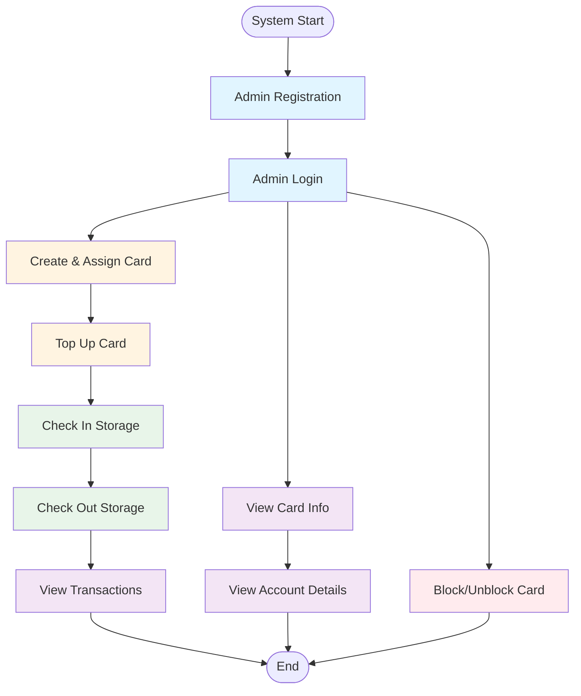

# PAYG System User Flow & API Endpoints

This document outlines the user flow and corresponding API endpoints for the PAYG (Pay-As-You-Go) System with RFID card management.

## User Flow Diagram



## Detailed User Flow Steps

### 1. Admin Registration & Authentication

#### Step 1.1: Admin Registration
**Endpoint:** `POST /api/auth/register/`  
**Authentication:** Not required  
**Description:** Register a new admin user

**Request:**
```json
{
    "first_name": "John",
    "last_name": "Doe",
    "phone": "1234567890",
    "address": "123 Main St",
    "user_type": "ADMIN",
    "password": "securepassword123",
    "password_confirm": "securepassword123"
}
```

**Response:**
```json
{
    "message": "User registered successfully",
    "user": {...},
    "token": "your-auth-token"
}
```

#### Step 1.2: Admin Login
**Endpoint:** `POST /api/auth/login/`  
**Authentication:** Not required  
**Description:** Login and get authentication token

**Request:**
```json
{
    "phone": "1234567890",
    "password": "securepassword123"
}
```

**Response:**
```json
{
    "message": "Login successful",
    "user": {...},
    "token": "your-auth-token"
}
```

**Next Step:** Use the token in Authorization header: `Token <your-token>`

---

### 2. Card Management (Admin Only)

#### Step 2.1: Create Card and Assign to User
**Endpoint:** `POST /api/cards/create_and_assign/`  
**Authentication:** Required (Admin Token)  
**Description:** Create a new card and assign it to a user. Also creates an account with initial balance.

**Request:**
```json
{
    "name_on_card": "John Doe",
    "user_phone": "9876543210",
    "initial_balance": "1000.00"
}
```

**Response:**
```json
{
    "message": "Card created and assigned successfully",
    "card": {
        "uuid": "card-uuid",
        "name_on_card": "John Doe",
        ...
    }
}
```

#### Step 2.2: Assign Existing Card to User
**Endpoint:** `POST /api/cards/assign/`  
**Authentication:** Required (Admin Token)  
**Description:** Assign an existing card to a user

**Request:**
```json
{
    "card_uuid": "card-uuid-here",
    "user_phone": "9876543210"
}
```

#### Step 2.3: Top Up Card
**Endpoint:** `POST /api/cards/topup/`  
**Authentication:** Required (Admin Token)  
**Description:** Add funds to a card's account balance

**Request:**
```json
{
    "card_uuid": "card-uuid-here",
    "amount": "500.00",
    "description": "Monthly top-up"
}
```

**Response:**
```json
{
    "message": "Card topped up successfully",
    "card_uuid": "card-uuid",
    "new_balance": "1500.00",
    "transaction": {...}
}
```

#### Step 2.4: Block/Unblock Card
**Endpoint:** `POST /api/cards/block/`  
**Authentication:** Required (Admin Token)  
**Description:** Block or unblock a card

**Request:**
```json
{
    "card_uuid": "card-uuid-here",
    "is_blocked": true
}
```

#### Step 2.5: View Card Information
**Endpoint:** `POST /api/cards/info/`  
**Authentication:** Required (Admin Token)  
**Description:** Get complete card information including user, account, transactions, and storage

**Request:**
```json
{
    "card_uuid": "card-uuid-here"
}
```

**Response:**
```json
{
    "uuid": "card-uuid",
    "name_on_card": "John Doe",
    "is_blocked": false,
    "user_info": {...},
    "account_details": {
        "balance": "1500.00",
        "transactions": [...],
        "storage_activities": [...]
    }
}
```

---

### 3. Storage Management (Admin Only)

#### Step 3.1: Check In Storage
**Endpoint:** `POST /api/storages/`  
**Authentication:** Required (Admin Token)  
**Description:** Create a new storage entry (check in)

**Request:**
```json
{
    "account_uuid": "account-uuid-here",
    "commodity": "Wheat",
    "weight": "1000.00",
    "check_in": "2024-01-01T08:00:00Z",
    "estimated_check_out": "2024-01-02T08:00:00Z",
    "hourly_rate": "10.00"
}
```

**Response:**
```json
{
    "uuid": "storage-uuid",
    "commodity": "Wheat",
    "weight": "1000.00",
    "check_in": "2024-01-01T08:00:00Z",
    "check_out": null,
    "is_active": true,
    ...
}
```

#### Step 3.2: Check Out Storage
**Endpoint:** `POST /api/storages/checkout/`  
**Authentication:** Required (Admin Token)  
**Description:** Check out storage, calculate cost, deduct from account, and create transaction

**Request:**
```json
{
    "storage_uuid": "storage-uuid-here",
    "check_out": "2024-01-02T12:00:00Z"
}
```

**Response:**
```json
{
    "message": "Storage checked out successfully",
    "storage": {...},
    "duration_hours": 28.0,
    "total_cost": "280.00",
    "new_balance": "1220.00",
    "transaction": {...}
}
```

#### Step 3.3: View Active Storage Entries
**Endpoint:** `GET /api/storages/active/`  
**Authentication:** Required (Admin Token)  
**Description:** Get all active storage entries (not checked out)

**Response:**
```json
{
    "total_active": 2,
    "storages": [...]
}
```

#### Step 3.4: View Storage by Card
**Endpoint:** `POST /api/storages/by_card/`  
**Authentication:** Required (Admin Token)  
**Description:** Get all storage entries for a specific card

**Request:**
```json
{
    "card_uuid": "card-uuid-here"
}
```

---

### 4. Account & Transaction Management (Admin Only)

#### Step 4.1: View Account Details
**Endpoint:** `POST /api/accounts/details/`  
**Authentication:** Required (Admin Token)  
**Description:** Get account details with all transactions and storage activities

**Request:**
```json
{
    "account_uuid": "account-uuid-here"
}
```

**Response:**
```json
{
    "uuid": "account-uuid",
    "balance": "1220.00",
    "user_info": {...},
    "card_info": {...},
    "transactions": [...],
    "storage_activities": [...]
}
```

#### Step 4.2: View Transactions by Card
**Endpoint:** `POST /api/transactions/by_card/`  
**Authentication:** Required (Admin Token)  
**Description:** Get all transactions for a specific card

**Request:**
```json
{
    "card_uuid": "card-uuid-here"
}
```

**Response:**
```json
{
    "card_uuid": "card-uuid",
    "card_name": "John Doe",
    "total_transactions": 5,
    "transactions": [...]
}
```

---

### 5. User Profile Management

#### Step 5.1: View Profile
**Endpoint:** `GET /api/auth/profile/`  
**Authentication:** Required (User Token)  
**Description:** Get current user's profile information

**Response:**
```json
{
    "uuid": "user-uuid",
    "first_name": "John",
    "last_name": "Doe",
    "phone": "1234567890",
    "address": "123 Main St",
    "user_type": "ADMIN",
    ...
}
```

#### Step 5.2: Change Password
**Endpoint:** `PUT /api/auth/change-password/`  
**Authentication:** Required (User Token)  
**Description:** Change user's password

**Request:**
```json
{
    "old_password": "oldpassword123",
    "new_password": "newpassword123",
    "new_password_confirm": "newpassword123"
}
```

#### Step 5.3: Logout
**Endpoint:** `POST /api/auth/logout/`  
**Authentication:** Required (User Token)  
**Description:** Logout and invalidate token

---

## Complete User Flow Sequence

### Typical Workflow: New User Onboarding

```
1. Admin Registration
   POST /api/auth/register/
   ↓
2. Admin Login
   POST /api/auth/login/
   ↓
3. Create Card & Assign to Client
   POST /api/cards/create_and_assign/
   ↓
4. Top Up Card (if needed)
   POST /api/cards/topup/
   ↓
5. Client Uses Card for Storage
   POST /api/storages/ (check in)
   ↓
6. Client Checks Out Storage
   POST /api/storages/checkout/
   ↓
7. View Transactions
   POST /api/transactions/by_card/
   or
   POST /api/accounts/details/
```

### Typical Workflow: Card Information Lookup

```
1. Admin Login
   POST /api/auth/login/
   ↓
2. View Card Information
   POST /api/cards/info/
   ↓
3. View Account Details (if needed)
   POST /api/accounts/details/
   ↓
4. View Transactions (if needed)
   POST /api/transactions/by_card/
```

### Typical Workflow: Storage Management

```
1. Admin Login
   POST /api/auth/login/
   ↓
2. Check In Storage
   POST /api/storages/
   ↓
3. View Active Storage Entries
   GET /api/storages/active/
   ↓
4. Check Out Storage
   POST /api/storages/checkout/
   ↓
5. Verify Transaction Created
   POST /api/transactions/by_card/
```

---

## Authentication Flow

```
┌─────────────────┐
│  User/Admin     │
└────────┬────────┘
         │
         │ 1. Register/Login
         ▼
┌─────────────────┐
│  POST /api/auth/│
│  register/      │
│  or             │
│  POST /api/auth/│
│  login/         │
└────────┬────────┘
         │
         │ Returns Token
         ▼
┌─────────────────┐
│  Store Token    │
│  for subsequent │
│  requests       │
└─────────────────┘
         │
         │ Use Token in Header:
         │ Authorization: Token <token>
         ▼
┌─────────────────┐
│  Access Protected│
│  Endpoints      │
└─────────────────┘
```

---

## Endpoint Summary by Category

### Authentication Endpoints
- `POST /api/auth/register/` - Register new user
- `POST /api/auth/login/` - Login and get token
- `POST /api/auth/logout/` - Logout and invalidate token
- `POST /api/auth/forgot-password/` - Request password reset
- `POST /api/auth/reset-password/` - Reset password with token
- `PUT /api/auth/change-password/` - Change password (authenticated)
- `GET /api/auth/profile/` - Get user profile

### Card Management Endpoints (Admin Only)
- `POST /api/cards/create_and_assign/` - Create and assign card
- `POST /api/cards/assign/` - Assign existing card
- `POST /api/cards/topup/` - Top up card balance
- `POST /api/cards/block/` - Block/unblock card
- `POST /api/cards/info/` - Get card information
- `GET /api/cards/` - List all cards
- `GET /api/cards/{id}/` - Get specific card
- `PUT /api/cards/{id}/` - Update card
- `DELETE /api/cards/{id}/` - Delete card

### Account Management Endpoints (Admin Only)
- `POST /api/accounts/details/` - Get account details with transactions
- `GET /api/accounts/` - List all accounts
- `GET /api/accounts/{id}/` - Get specific account
- `PUT /api/accounts/{id}/` - Update account
- `DELETE /api/accounts/{id}/` - Delete account

### Transaction Endpoints (Admin Only)
- `POST /api/transactions/by_card/` - Get transactions by card UUID
- `GET /api/transactions/` - List all transactions
- `GET /api/transactions/{id}/` - Get specific transaction
- `POST /api/transactions/` - Create transaction
- `PUT /api/transactions/{id}/` - Update transaction
- `DELETE /api/transactions/{id}/` - Delete transaction

### Storage Management Endpoints (Admin Only)
- `POST /api/storages/` - Create storage entry (check in)
- `POST /api/storages/checkout/` - Check out storage
- `POST /api/storages/by_card/` - Get storage entries by card
- `GET /api/storages/active/` - Get active storage entries
- `GET /api/storages/` - List all storage entries
- `GET /api/storages/{id}/` - Get specific storage entry
- `PUT /api/storages/{id}/` - Update storage entry
- `DELETE /api/storages/{id}/` - Delete storage entry

---

## Notes

- **Authentication**: Most endpoints require authentication using Token authentication
- **Admin Access**: Card, Account, Transaction, and Storage management endpoints require admin privileges
- **Token Format**: Include token in request header as: `Authorization: Token <your-token>`
- **Base URL**: All endpoints are prefixed with `/api/` (e.g., `/api/auth/login/`)
- **Documentation**: Full API documentation available at `/swagger/` or `/redoc/`

---

## Quick Reference

| Action | Endpoint | Method | Auth Required |
|--------|----------|--------|---------------|
| Register | `/api/auth/register/` | POST | No |
| Login | `/api/auth/login/` | POST | No |
| Create Card | `/api/cards/create_and_assign/` | POST | Admin |
| Top Up | `/api/cards/topup/` | POST | Admin |
| Check In | `/api/storages/` | POST | Admin |
| Check Out | `/api/storages/checkout/` | POST | Admin |
| View Card Info | `/api/cards/info/` | POST | Admin |
| View Account | `/api/accounts/details/` | POST | Admin |
| View Transactions | `/api/transactions/by_card/` | POST | Admin |
